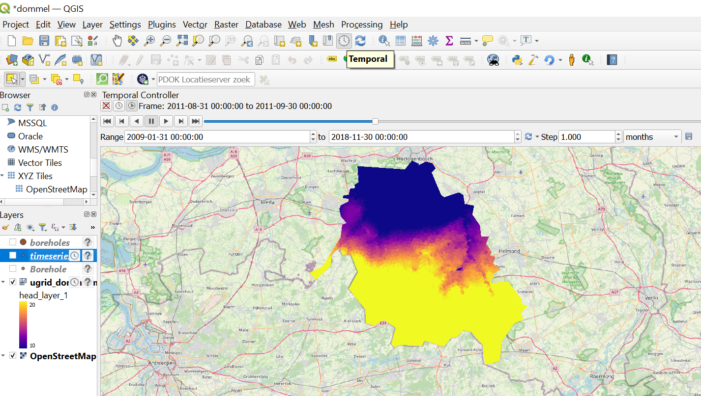
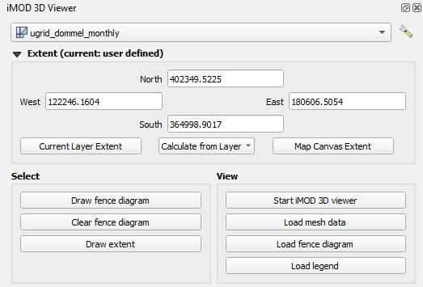
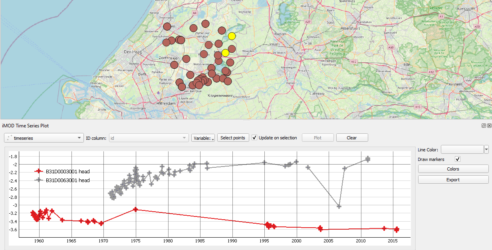
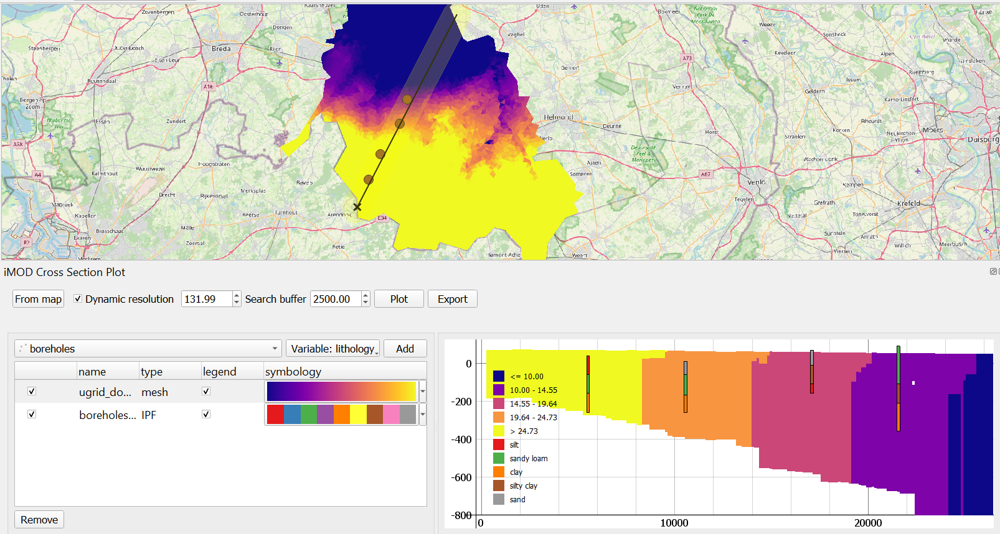
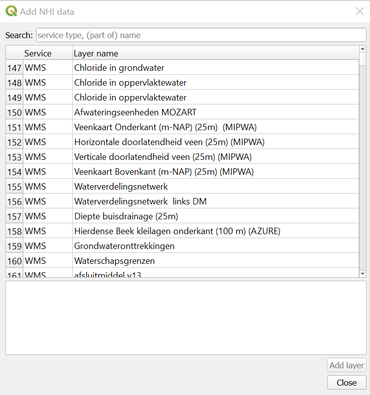

.. toctree::
    :maxdepth: 2 
    :hidden:

***********************
QGIS Plugin User Manual
***********************

Configuration
#############

1. You probably want to change the language settings in QGIS, 
   if it defaults to Dutch, it’s *Extra > Opties > Algemeen*. 
   Change it to to US settings (that’s generally the safest default).
   You will need to restart QGIS before this has effect.

  .. figure:: screenshots/qgis/qgis-language-settings.png

    The QGIS language settings

2. Start up QGIS, go to *Plugins > Manage and Install plugins > Installed*. 
   Make sure the iMOD plugin is ticked.

   .. figure:: screenshots/qgis/qgis-installed-plugins.png

     The QGIS plugin manager. Here you can install and activate plugins.

If the installation and configuration was succesful, 
the plugin should be visible in your toolbar.

   .. figure:: screenshots/qgis/imod-toolbar.png

     The iMOD plugin toolbar

Functionality
#############

The QGIS plugin currently consists of five widgets, 
of which the functionality
will be described in the next section:

* Open IPF
* 3D Viewer
* Time Series
* Cross section
* Add NHI data

|ipf-reader| Open IPF
----------------------
Open IPF file and lets QGIS interpret it as a regular shapefile with points. 
Required to interpret timeseries in the Time Series widget, 
as well as to visualize borelogs in Cross section and 3D Viewer widget.
To an IPF timeseries file it attaches two columns to the attribute table of the vector
layer, namely a "start time" and "end time". 
This allows using the QGIS Temporal Controller Panel to browse through time, 
and see which points have data defined within a certain time frame.

* Press the "..." button to select a path to a file (as you would in other QGIS windows).

* Press "Add" to load the file into the QGIS explorer.

.. warning:: 

  Currently the IPF reader is not able to read every IPF file, 
  as iMOD 5 supports quite a wide range of IPF files.
  For example, iMOD 5 supports both whitespace and comma seperated files, 
  whereas the QGIS plugin only supports comma seperated IPF files.
  If the plugin is unable to read your IPF file, 
  it is best to 
  `read the file with iMOD Python <https://deltares.gitlab.io/imod/imod-python/api/generated/io/imod.ipf.read.html>`_ 
  and consequently 
  `write it again <https://deltares.gitlab.io/imod/imod-python/api/generated/io/imod.ipf.write.html>`_. 
  This can help, because the IPF reader in iMOD Python 
  is a lot more flexible, but its writer always writes
  to a specific format. 
  We plan to improve the flexibility of the plugin's IPF reader.

.. figure:: screenshots/qgis/ipf-reader.png

    The Open IPF widget. 

    The temporal controller panel and map canvas of QGIS. 
    The temporal controller panel is opened by clicking the clock in the "map navigation" toolbar.

|3d-viewer| 3D Viewer 
---------------------
The 3D viewer widget creates a connection between QGIS and the iMOD 3D viewer. 
It allows you to make selections in QGIS and forward them to the 3D viewer.
Note that there are two perquisites for the iMOD viewer to correctly render mesh data:

#. The mesh data needs to be stored in a UGRID file

#. Vertical axis is stored as variables :code:`top_layer_*` and :code:`bottom_layer_*`. 
   The data belonging to each layer follows the following format :code:`head_layer_*`, 
   e.g. for a variable :code:`head`.

This means that not all data that can be loaded in QGIS as mesh can be viewed in the 3D viewer.
Currently only UGRID meshes and IPF borelog files are supported.

* Use the selection box at the top to select the mesh layer/ipf file you want to inspect in the 3D viewer.

* The "Extent" group allows the user to manually set the bounding box by 
  editing the numbers under "North", "East", "South", and "West",
  and more:

  * The "Current Layer Extent" button sets the bounding box to the extent of the layer 
    selected in the QGIS explorer.

  * The "Calculate from Layer" box allows you to select a dataset loaded in the QGIS explorer
    to calculate the extent from.

  * "Map canvas extent" sets the bounding box to the map canvas
  
* The "Select" group contains a set of buttons to spatially select data to be forwarded to the 3D viewer

  * The "Draw fence diagram" button allows to draw lines on the map canvas which can be forwared to the 3D viewer to draw a fence diagram.
    Press the button to start drawing mode. Left-click to start drawing a line; right-click to stop drawing the line.

  * The "Clear fence diagram" button clears all lines from the map canvas
  
  * The "Draw extent" buttons allows you to click and drag a box that allows you to set a bounding box.
    The iMOD viewer will only load the data within this boundary box, 
    which can be useful when exploring specific areas in large datasets.
    Drawing an bounding box will update the "Extent" widget.
    Right-click to stop drawing the extent.

* The "View" group contains a set of buttons to interact with the 3D viewer

  * "Start iMOD viewer" starts the iMOD viewer and immediately loads the data selected in the widget.

  * "Load mesh data" remove previous data from viewer and load new mesh data in it.
  
  * "Load fence diagram" loads the lines drawn with "Draw fence diagram" to the viewer 
    and renders a fence diagram.

  * "Load legend" transfers legend in the QGIS map layer to fence diagram and/or mesh data in the 3D viewer 
    for the selected variable in the QGIS map canvas.
  

  The 3D viewer widget. It will be opened on the right-hand side of the screen.

.. note:: 

    The 3D Viewer widget does not forward any data to the iMOD 3D viewer,
    it only forwards the path to the data to load, and a command how to load it.
    As of now, the widget does not understand changes made by the user in the 3D viewer.
    It only supports "one-way traffic" towards the viewer.

|time-series| Time Series
-------------------------
The Time Series widget visualizes time series stored in IPF files or mesh data 
in a graph window. You can freely zoom and drag the graph in this window.
Sometimes you lose your view of the lines by dragging too fast;
so to reset your view, you can click on the small "A" in the 
bottom left corner of the graph window. 
The buttons in the widget change, depending on which data type is being selected.

* Use the box on the top left of the widget to select the ipf file or mesh data to plot.

* "ID column" box allows you to select the column of the attribute table 
  that sets the point ID's to be plotted in the legend.

* The "Variable" box sets the variable (or variables in case of IPFs) to be plotted.

* The "Layer" box sets the layers of a mesh to be plotted. Multiple layers can be selected.

* The "Select points" box allows selecting points in a dataset to plot. 
    
    * When selecting on a IPF, 
      left-click and drag a box to select points. 
      *SHIFT + click* to
      add points to the existing selection. 
      Press *CTRL + ALT + A* to deselect all points. 
      You can also click *Deselect features from all layers*
      in QGIS' selection toolbar.
      To stop selecting, click *Pan Map* in QGIS' Map Navigation toolbar,
      or close the Timeseries widget.
    
    * When selecting on a mesh, 
      left-click to select a point on a mesh to plot, 
      right-click to stop selecting.

* The "update on selection checkbox": when checked on, 
  the widget automatically plots newly selected points for point data 
  or plots data at the location of the cursor for mesh data.

* The "Line Color" box allows you to set a color of a selected line.
  You can select a plotted line by clicking on it.

* The "Draw markers" check box enables the drawing of markers on each data point.
  Recommended when there are not many datapoints to show and/or 
  when the intervals between data points are not constant.

* The "Colors" button opens up a new window that lets you select different colorramps.

* The "Export" button allows you to export your plot to an image file (.png, .jpg etc.),
  a vector file (.svg for Inkscape), or a .csv to allow for plotting in different software.

    The Time series widget and map canvas for points. Notice that the widget can handle irregular time series filled with gaps.
    The yellow points on the map canvas indicate the selected points.

.. figure:: screenshots/qgis/time-series-mesh.png

    The Time series widget and map canvas for a mesh. The red crosses indicate
    the location of the plotted time-series.

.. note:: A known issue with a multiple monitor setup is that the grid 
  behind the plot might be plotted way off. 
  See the :ref:`known issues section <plot_axis_off>` for more info and 
  how to fix this.

|cross-section| Cross-section 
-----------------------------
The cross-section widget allows you to draw cross-sections of both mesh and raster data.
Note that the widget expects that the vertical axis is stored as variables 
:code:`top_layer_*` and :code:`bottom_layer_*`. 
The data belonging to each layer follows the following format :code:`head_layer_*`, 
e.g. for a variable :code:`head`.
For time dependent data, when the Temporal Controller Panel is turned on, 
the cross-section plot is automatically updated when a different moment in time is selected.

The cross-section widget consists of three component:

#. The top bar
#. A styling table, specifying the styling and order of elements to plot.
#. A graph window, in which the cross-section is plotted.

The functionality of each component is explained below.

#. The top bar
    * "Select location" lets you draw a line on the map, along which a cross-section will be drawn.
      Left-click to start and to stop drawing a line. Right-click to stop the selection.
    * When the "Dynamic resolution" checkbox option is switched on, 
      the amount of points along which data is sampled for the plot is set to a fixed number
      and resolution varies. 
      Turning this off and setting a very small resolution size might improve precision, 
      but will definitely result in a performance loss.
    * The "Search buffer" box sets the tangential distance from which boreholes will
      will be selected.
    * The "Plot" button plots the data and styling selected in the styling table to the
      graph window. 
    * The "Export" button allows you to export your plot to an image file (.png, .jpg etc.),
      a vector file (.svg for Inkscape), or a .csv to allow for plotting in different software.
      
#. The styling table
    * The top left selection box allows you to choose the dataset to plot.
    * The "Variable" box, you can select the variable to plot. 
    * The "Layer" box lets you select individual layers to plot. By default all are plotted.
    * The "As line(s)" checkbox turns on an option to plot data as lines. 
      Useful to plot layer tops or bottoms to show interfaces. 
    * The "Add" button adds a dataset to the table.

#. The plot window
    * Right-click the plotting window to set zoom options.
    * You can click the small "A" in the bottom left corner to reset zoom.

    The "Cross-section" widget and map canvas. 
    An example is shown in which layer ids are plotted as colors,
    and borelogs are plotted as bars.

.. note:: A known issue with a multiple monitor setup is that the grid 
  behind the plot might be plotted way off. 
  See the :ref:`known issues section <plot_axis_off>` for more info and 
  how to fix this.

|nhi-data| Add NHI-data
-----------------------
Opens up a window to select data from the NHI portal to load directly in QGIS.
The NHI is the `Netherlands Hydrological Instrument <https://www.nhi.nu/>`_ .
The NHI data provides datasets with different kinds of services:

* a "Web Map Service" (WMS), which provides a map with a (fixed) legend.
* a "Web Feature Service" (WFS), which provides features from vector data via the internet.
* a "Web Coverage Service" (WCS), which provides raster data via the internet.

You can use the search bar to search for datasets of your liking.

    The "Add NHI window"

.. note::
    
    Experience has shown that sometimes these services 
    are hard to reach and data cannot be loaded.

