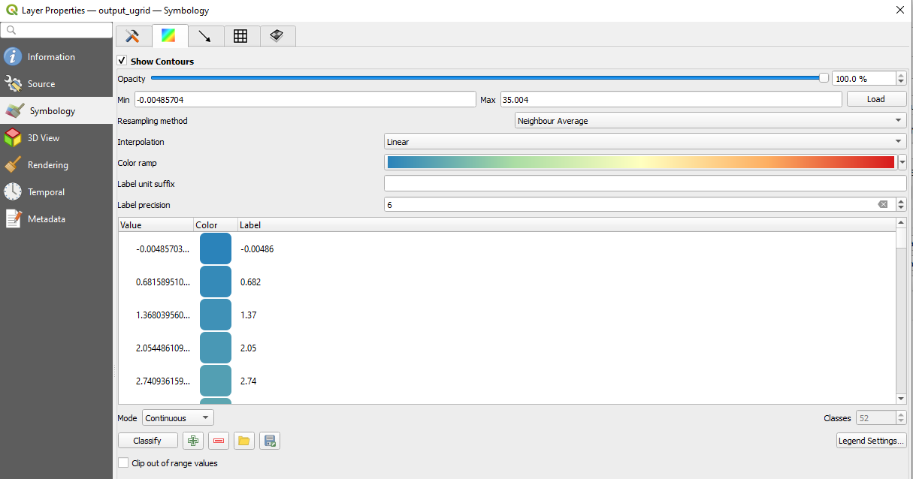
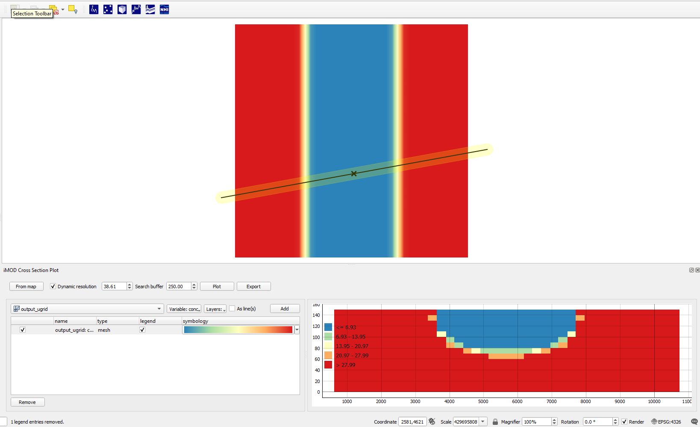

*****************************
A conceptual fresh-salt model
*****************************

In this example we create an example fresh-salt groundwater model of
a strip-shaped freshwater lens, which could be a very simple analogue
of a barrier island.

The workflow consists of the following steps:

1. Creating a model with an iMOD-python script
2. Running the model in a terminal with iMOD-WQ
3. Use iMOD-python to post-process the model output (IDF) 
   to a data format supported by QGIS (UGRID) 
4. Viewing a cross-section in iMOD QGIS plugin
5. Use the plugin to view the results in the iMOD 3D viewer

===================
Creating a model
===================

The iMOD-python script below creates a simple 3D iMOD-WQ model.

To install iMOD-python, see 
`these instructions <https://deltares.gitlab.io/imod/imod-python/installation.html>`_.

We define a middle strip which has fresh recharge (``rch``) applied, and
the sides have a fixed concentration (``bnd = -1``) 
of 35 (``sconc = 35.``) in the top layer.
This creates freshwater lens along the strip.

.. literalinclude:: scripts/wq/create_input.py
    :caption: create_wq_input.py
    :language: python

====================
Running the model
====================

This model requires the iMOD-WQ kernel, 
which is part of iMOD 5 and which you can download 
`for free here after registering 
<https://oss.deltares.nl/web/imod/deltares-executables-of-imod>`_.
It usually takes only a few minutes before a link is sent.

Open a terminal (cmd.exe is fine, 
`but the cool kids use Powershell 
<https://deltares.gitlab.io/imod/imod-practical-tips/
how_to_look_like_a_pro.html>`_)
and call the following lines of code:

.. code-block:: console
    
    ./path/to/iMOD-WQ.exe ./FreshwaterLens.run

This will run the iMOD-WQ model, and should not take more than 10 seconds.

.. image:: screenshots/workflows/wq/cmd_run_output.png

=======================
Convert output data
=======================

iMOD-WQ writes IDF files, a data format used in iMOD 5, 
which not many other software packages support.
Therefore iMOD-python allows for reading these IDF files 
and converting them to other data formats in Python.

In this example we convert the output to a UGRID file, 
which can be read by QGIS.

.. literalinclude:: scripts/wq/convert_output.py
    :caption: convert_output.py
    :language: python

==============================
Viewing the results in QGIS
==============================

Start QGIS and open the ``./results/output_ugrid.nc`` file as a mesh.

.. figure:: screenshots/workflows/wq/load_mesh.png

    Where to find the action to load a mesh layer

You can select the variable to plot on the map canvas by right-clicking the 
*output_ugrid* layer in the *Layers* panel, and then navigating to:
*Properties > Symbology*

Next select which variable to plot in the group selection screen by 
clicking the color ramp next to the variable name, which will render
the variable on the map canvas.

.. figure:: screenshots/workflows/wq/group_selection.png

    Where to find the group selection screen. 
    Here you can select the variables to be plotted.
    The red circle indicates where the color ramp symbol can be found.

Colormaps can be set by navigating to the color selection menu

    The color selection menu, here you can set the colormap that will be used,
    as well as adjusting its binning. 
    In these example screenshots we use the colormap "Spectral".

Next, open the iMOD plugin's cross-section tool |cross-section| 
and draw a cross-section by clicking *from Map* and right-clicking to stop drawing. 
Then select *conc* as variable to be plotted, and click *Add*.
Next click *Plot*.

By default the tool will plot with a green to blue gradient called *Viridis*,
but we can change the gradient by clicking the dataset's gradient box under 
*symbology* in the table. 

This opens up a color dialog, where we can select the color ramp.
Clicking the small arrow next to the color gradient box in the dialog will 
allow selecting presets.
We chose "Spectral" and also select "Invert Color Ramp" in the examples, 
but you can select whatever colormap you think is suitable!

    You should see this if you followed precisely what we did.

============================================
Viewing the results in the iMOD 3D Viewer
============================================

As a final step we will look at the results in the iMOD 3D Viewer.
Click the 3D viewer symbol |3d-viewer| in QGIS, which will open up the
3D viewer widget of the iMOD plugin.

First, click the *Draw Extent* button to draw an extent to be plotted.
This can be very useful for large datasets, to only look at a smaller zone 
of the data.

Second, click *Start iMOD 3D viewer* to start the iMOD 3D viewer.
Third, click *Load mesh data* to load the mesh you selected in the QGIS widget 
to be opened in the 3D viewer.

Fourth, to plot the data, under the *Imported files*, 
expand the data selection tree, and under *Layered datasets*, selecting *conc*.

Finally, you can migrate the colormap you used in QGIS by clicking *Load legend*.

.. figure:: screenshots/workflows/wq/3d_viewer.png

    If you followed the instructions, you should see this.

===========
Concluding
===========

In short, we wrote model input with iMOD-python, ran a model with iMOD-WQ, 
converted its output to UGRID with iMOD-python, and viewed the results in QGIS
and the iMOD 3D viewer.

.. |3d-viewer| image:: screenshots/qgis/icons/3d-viewer.png
   :width: 40px
   :height: 40px

.. |cross-section| image:: screenshots/qgis/icons/cross-section.png
   :width: 40px
   :height: 40px